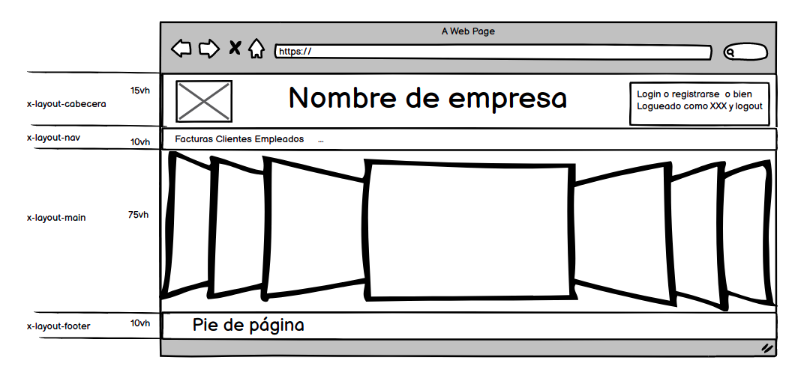
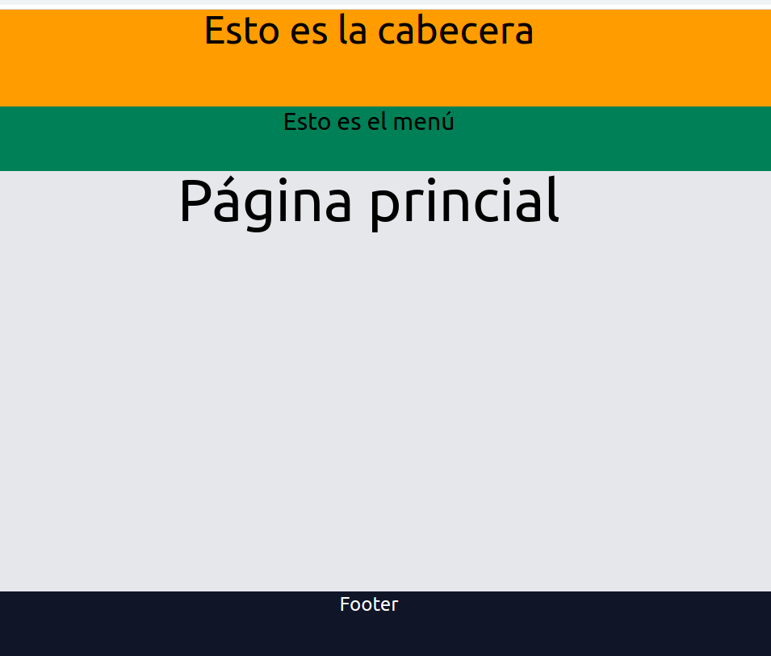
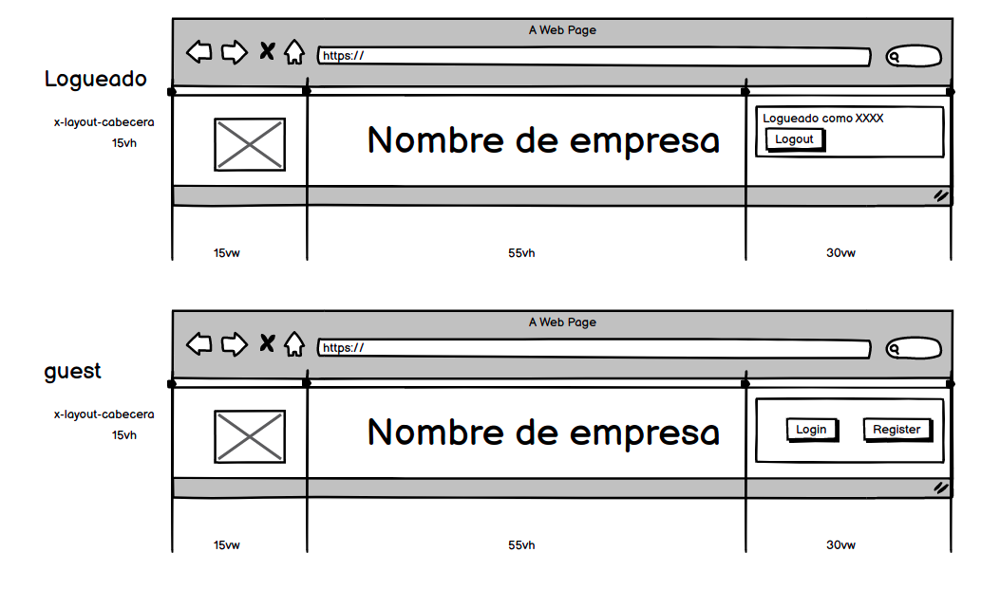

## Layout
La imagen siguiente muestar el layout de nuestro desarrollo

 

El html de este layout quedaría cómo sigue (ponemos color de fondo para verlo)
```css
<!doctype html>
<html lang="en">
<head>
    <meta charset="UTF-8">
    <meta name="viewport"
          content="width=device-width, user-scalable=no, initial-scale=1.0, maximum-scale=1.0, minimum-scale=1.0">
    <meta http-equiv="X-UA-Compatible" content="ie=edge">
    <title></title>
    <link rel="stylesheet" href="{{asset('css/app.css')}}">
</head>
<body>
<header class="h-15v bg-yellow-500 text-center text-5xl">
    <h1 > Esto es la cabecera</h1>
</header>
<nav class="h-10v bg-green-700  text-center text-3xl">
    <h2>Esto es el menú</h2>
</nav>
<main class="h-65v bg-gray-200 text-center text-7xl ">
    <h1>Página princial</h1>
</main>
<footer class="h-10v bg-gray-900 text-center text-2xl">
    <h1 class="text-white">Footer</h1>
</footer>

</body>
</html>
```

Los estilos son estilos de ---tailwind---. El estilo h-10v, ... lo hemos creado, ya que tailwind no tiene exactamente esa medida.

Para realizar dicha modificación añadimos en el fichero ****tailwind.config.js**** añadiendo las líneas de height

```javascript
  height:{
                "15v":"15vh",
                "10v":"10vh",
                "75v":"75vh",
                "65v":"65vh",
            }
```
## Creando componentes
Una opción que nos permite laravel es crear componentes.
En una primera instancia lo podemos ver cómo crear nuevos elementos html, a los cuales le damos un estilo

Los componentes serán elementos html que empiezan con la letra *****x-***** y los ubicaremos bajo la carpeta *****components*****

Modificamos la plantilla anterior  creando los componentes bajo la carpeta layout:
1. <x-layout.cabecera>
2. <x-layout.nav>
3. <x-layout.main>
4. <x-layout.footer>

El texto que le pongamos en un elemento, dentro del componente se recogerá con la variable ```javascript {{$slot}}```
Después de crear los componentes observamos que tenemos la misma página:


Cómo vemos, el layout tiene 4 secciones. Vamos a craar un componente para cada sección
### x-layout.cabecera
Pretendemos el siguiente diseño



